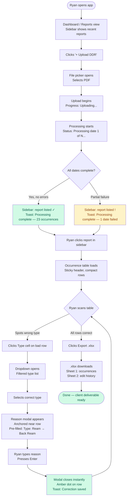
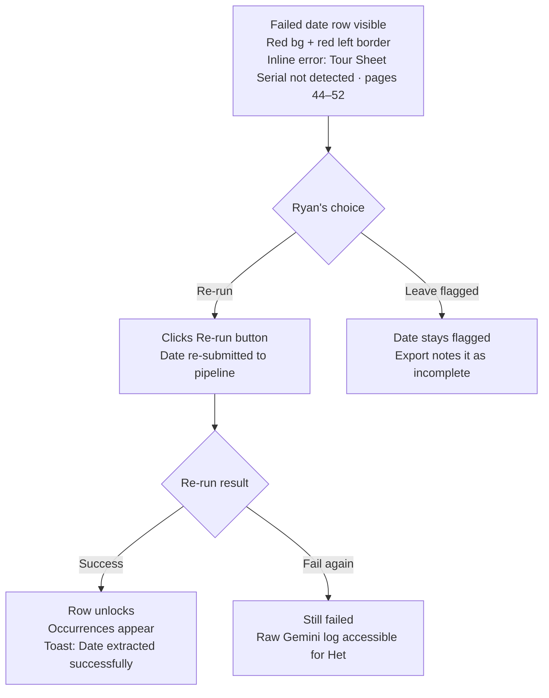
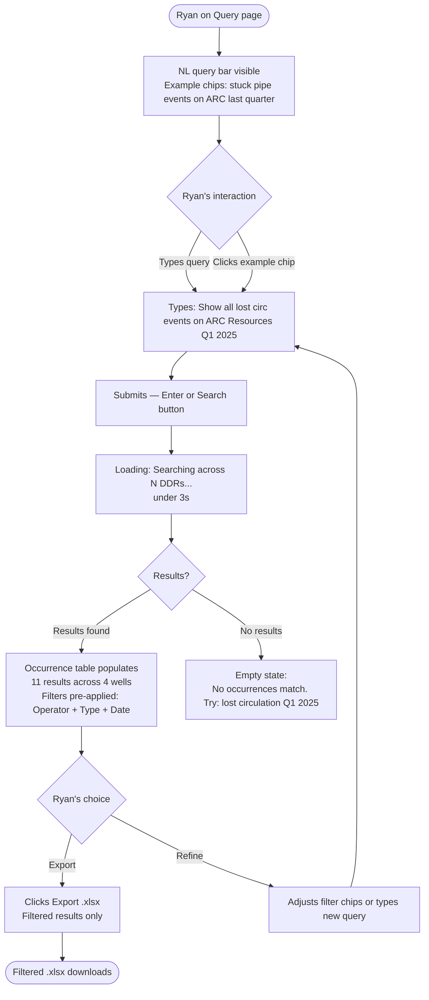
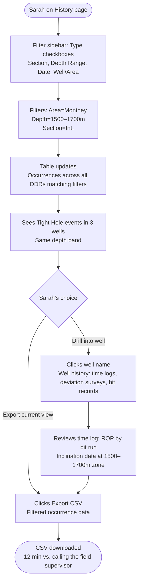
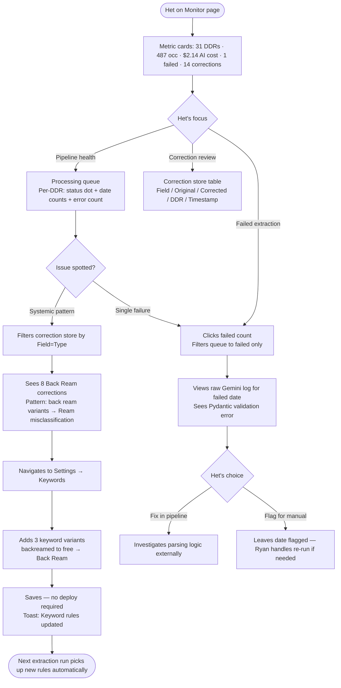

# UX Design Specification — Canadian Energy Service Internal Tool

**Author:** Het
**Date:** 2026-05-05

---

<!-- UX design content will be appended sequentially through collaborative workflow steps -->

## Executive Summary

### Project Vision

The CES DDR Intelligence Platform transforms the way Canadian Energy Services manages drilling data. CES receives 10–15 Pason-generated DDR PDFs per day — each 100–300 pages of structured field data. Today, every insight requires manual extraction. The platform eliminates this: upload a PDF, get a structured occurrence table in under 90 seconds, edit it inline, export to Excel for clients. Over time, every correction feeds back into the extraction pipeline — the system accumulates domain knowledge no general-purpose AI model carries.

The internal tool follows the CES Energy Solutions brand identity: deep navy header/navigation, white content surfaces, amber-gold accent anchored by the CES starburst logo mark. Desktop-first, data-dense, built for field professionals who trust what feels familiar.

### Target Users

| User | Role | Core Job-to-be-Done |
|---|---|---|
| **Ryan** (Ops / Management) | Primary daily user — uploads DDRs, reviews and corrects occurrences, exports to clients | Fast, accurate occurrence table → client-ready Excel in minutes, not hours |
| **Sarah** (Drilling Engineer) | Pre-well research — offset well history, time logs, bit records, deviation surveys | Access structured well history without opening source PDFs |
| **Het** (Platform Admin) | Pipeline health monitoring, correction store review, keyword rule management | Keep extraction accurate; detect systemic misclassification before it reaches a client report |

All three users are authenticated internal CES staff with identical full access — no role differentiation in V1.

### Key Design Challenges

1. **Data density vs. scannability** — The occurrence table is 7 columns wide and can reach 100+ rows. Users must instantly spot misclassified rows and edit them without losing scroll position. The table is also the primary client deliverable surface — it must feel trustworthy, not like a raw data dump.

2. **Extraction trust signals** — Ryan is sending this data to clients. Failed dates, warnings, and partial extractions must be unmissable at a glance — never buried in a log only Het sees. Visual confidence indicators need to be baked into the table and processing views, not bolted on.

3. **Workflow state complexity** — A single DDR passes through: queued → processing → per-date success/warning/failed → occurrence review → editing → exported. Multiple DDRs run concurrently. Het needs to see the full pipeline state at a glance; Ryan needs to know his specific report is ready. These two mental models require different views of the same underlying state.

### Design Opportunities

1. **Inline editing as a first-class experience** — The correction loop is the platform's core differentiator. Every edit Ryan makes today makes the system smarter tomorrow. Making that editing feel instant and frictionless — click cell, change, reason modal, submit, zero scroll loss — is the interaction that drives the accuracy flywheel. If editing feels like friction, users skip it; if it feels like power, they embrace it.

2. **CES brand-anchored visual design system** — Navy + white + amber, type badges color-coded by occurrence category, section badges (Surface=emerald, Int.=sky, Main=indigo) already defined in the PRD. A consistent, opinionated design system makes the occurrence table scannable and makes the tool feel like a CES product — not a generic internal app. Users trust what feels like it belongs.

3. **NL query as a power-user shortcut** — Natural language search across full DDR history is novel in this domain. Surfacing example queries prominently ("stuck pipe events on ARC Resources last quarter") lowers the barrier for users skeptical of AI search. The query interface should feel like talking to someone who knows every DDR CES has ever run.

## Core User Experience

### Defining Experience

The core loop is: upload DDR PDF → occurrence table populates → user scans and corrects errors → exports to client. Every other surface (NL query, pipeline monitor, keyword management, well history) exists to keep that loop trustworthy and fast.

The primary interaction that defines the product's value: **inline cell editing with reason capture**. That is not a correction flow — it is the product. Each edit feeds the correction store that improves future extractions. The UX must treat editing as a first-class action, not an exception path.

### Platform Strategy

- **Platform:** Web application — React/Vite/Tailwind, served internally
- **Input modality:** Mouse + keyboard. No touch or mobile requirement in V1
- **Viewport:** Desktop-first, minimum 1280px. Data-dense tables expected; horizontal scroll on overflow is acceptable
- **Browser support:** Chrome (primary), Edge, Firefox. Safari best-effort. No legacy/IE
- **Connectivity:** Always-online internal tool. No offline requirement
- **State persistence:** Processing queue durable across app restarts (backend responsibility); frontend reflects backend state via polling or SSE

### Effortless Interactions

- **Inline cell edit:** Single click opens field in place. Edit, submit reason modal, done. Zero scroll position loss. No modal backdrop, no page transition
- **Processing status:** Visible without navigating away. Non-blocking — user can browse occurrence tables while a new DDR processes in background
- **Export:** One click from reviewed occurrence table. No multi-step wizard. File downloads immediately
- **Failed date visibility:** Failure indicators surface in the occurrence table itself — not only in a separate log view. Ryan must not need to go looking

### Critical Success Moments

1. **First processed DDR** — occurrence table appears with correct rows. Ryan sees 23 occurrences, recognizes the data, trusts it. Moment: "this actually works"
2. **First client export** — `.xlsx` opens cleanly with correct dark header row and formatted columns. 3 minutes instead of 3 hours. Moment: "I'm never doing this manually again"
3. **Correction sticks** — weeks later, a DDR with similar text auto-classifies correctly without an edit. Ryan notices the system learned. Moment: trust becomes habit
4. **Cross-job query answer** — Ryan types a client question in plain English and gets 11 events across 4 wells in under 3 seconds. Moment: "this knows everything we've ever done"

### Experience Principles

1. **Trust is earned at the row level** — every occurrence row must signal its own confidence. Edit indicators, failed-date flags, type badges — the table must be self-narrating without requiring a separate status view
2. **Editing is the product, not an escape hatch** — inline editing is the primary interaction, not a correction flow. The reason capture modal is lightweight, not a gate. Corrections are how the system learns
3. **State is always visible** — processing, queued, failed, exported — no hunting. The platform surfaces what's happening before the user asks
4. **Desktop data density done right** — this is a tool for people who live in Excel. Dense tables are expected and welcome; what is not welcome is a dense table that is hard to scan. Badge colors, column hierarchy, and row indicators carry the scanning burden

## Desired Emotional Response

### Primary Emotional Goals

**Dominant emotion: Professional Confidence.** This is an internal ops tool, not a consumer product — users don't need delight or excitement. Ryan is sending occurrence data to clients. He needs to feel *certain* the data is accurate and the export is defensible before it leaves his hands. Every design decision should serve that certainty.

Supporting emotions: **Empowerment** when correcting classifications (teaching the system, not cleaning up a mess), and **Calm** during processing (progress is visible and specific, not silent or alarming).

### Emotional Journey Mapping

| Stage | Without Platform | Target Feeling With Platform |
|---|---|---|
| Upload DDR | Dread — hours of manual extraction ahead | Calm — "the machine handles this" |
| Occurrence table loads | N/A | Quiet satisfaction — "it got most of them right" |
| Spotting a wrong classification | Frustration — manual work anyway | Empowered — "I can fix this and teach it" |
| Editing + reason capture | N/A | In control — correction is meaningful, not just a fix |
| Export to client | Anxiety — "did I miss anything?" | Confidence — "I reviewed it, it's defensible" |
| Returning next week | Skepticism — "will it be better?" | Trust — "it learned from last time" |
| Error / failed date | Alarm — "what got dropped silently?" | Informed — "I can see exactly what failed and rerun it" |

### Micro-Emotions

- **Trust over skepticism** — badge colors, edit indicators, and failed-date flags build trust incrementally. Visual ambiguity destroys it immediately
- **Empowerment over frustration** — when Ryan corrects a row, the UI must make him feel like he's logging intelligence, not cleaning up AI mistakes
- **Calm over anxiety** — processing status must be reassuring and specific. "Processing date 7 of 15..." feels calm; a silent spinner feels like something broke

**Emotions to actively avoid:**
- Anxiety about data correctness — if the table reads like a raw AI dump, Ryan won't trust it for client work
- Helplessness on errors — failed extractions must feel fixable, not opaque
- Frustration from table interaction — scroll loss, modal jank, or complex edit flows will cause users to skip corrections entirely, breaking the accuracy flywheel

### Design Implications

- **Confident Control** → clear visual hierarchy in the occurrence table; type badges make rows readable at a glance; no visual noise or decorative elements competing with data
- **Empowerment on edit** → reason capture modal is short and purposeful — not a bureaucratic gate. UI confirms the correction was stored and that it will influence future runs
- **Calm on processing** → progress indicators with specifics (date N of M, % complete), not generic spinners; non-blocking so the user can continue working
- **Trust on errors** → failed dates displayed inline in plain English with the specific error reason; re-run action immediately adjacent, not buried in a separate log view

### Emotional Design Principles

1. **Certainty before export** — the occurrence table must communicate confidence level before Ryan clicks export. Unreviewed rows, failed dates, and edited rows each carry distinct visual treatment
2. **Corrections feel like contribution** — the reason capture modal should reinforce that the user is training the system, not just patching a bug. Copy, interaction speed, and confirmation all support this framing
3. **Silence is never ambiguous** — no silent states. If processing stopped, say why. If an export is ready, say so. If a date failed, say which one and why. The platform never makes the user wonder what happened

## UX Pattern Analysis & Inspiration

### Inspiring Products Analysis

**1. Linear (issue tracker)**
Linear solves data-dense lists with keyboard-first editing and status badges that carry full meaning at a glance. Their inline edit flow — click → type → submit — has zero context loss. Empty states and error states are informative, never alarming. Visual hierarchy makes 50-item lists scannable in seconds. The occurrence table draws directly from this pattern.

**2. Retool / Internal (internal tools platform)**
Built for exactly this use case: field professionals doing structured data work. Table-first layouts, persistent filter panels, action buttons adjacent to data rows. Retool has solved "dense table + inline edit + export" more times than any other reference. Their approach to filter panels (always visible, never modal) maps directly to the occurrence history view.

**3. Datadog (monitoring / observability)**
Het's pipeline monitoring view maps directly to Datadog's model: status indicators (green/yellow/red), per-job drill-down, cost metrics, time-series per run. They make complex operational state legible without overwhelming. The DDR processing queue and cost tracking surface borrows from this directly.

**4. Excel / modern spreadsheets (familiarity baseline)**
Ryan uses Excel daily. Familiar patterns — row/column structure, sticky headers, keyboard navigation in cells — reduce learning curve to near zero. The occurrence table should feel like a smart Excel sheet, not a foreign UI.

### Transferable UX Patterns

| Pattern | Source | Apply To |
|---|---|---|
| Click-to-edit cell, blur-to-cancel | Linear / Retool | Occurrence table inline edit |
| Status pill badges (colored, labeled) | Linear | Type + Section badges in occurrence table |
| Persistent sidebar filter panel | Retool | Occurrence history filtering |
| Processing job list with per-item status | Datadog | DDR processing queue view |
| Example query chips below search input | Various | NL query interface prompt suggestions |
| Sticky table header on vertical scroll | Excel / Retool | Occurrence table column headers |
| Toast notification on save / export complete | Linear | Edit saved confirmation, export ready |
| Per-item drill-down from list view | Datadog | DDR → per-date extraction detail |

### Anti-Patterns to Avoid

| Anti-pattern | Why to Avoid |
|---|---|
| Modal-heavy editing (full-page forms for cell edits) | Breaks flow, loses scroll position, feels disproportionately heavy for single-cell changes |
| Pagination on occurrence table | Users scan 100 rows holistically — paginating to 20 rows breaks the mental model and makes pattern recognition impossible |
| Generic loading spinner with no detail | Creates anxiety during 90-second DDR processing — "Processing date 7 of 15..." is calm; a silent spinning circle reads as broken |
| Icon-only sidebar navigation | Field staff are not power users of abstract nav icons — label everything, always |
| Silent auto-save without confirmation | For client-deliverable data, silent saves feel risky. A brief toast ("Correction saved") builds trust incrementally |
| Inline error messages that disappear before the user reads them | Failed date notices must be persistent in the table, not transient toasts |

### Design Inspiration Strategy

**Adopt directly:**
- Linear's inline cell editing interaction model — click activates field, escape cancels, enter/tab confirms, no scroll loss
- Datadog's per-job status column pattern — each DDR row shows success/warning/failed count at a glance
- Retool's persistent filter panel — always visible on occurrence history, no "open filter" button required

**Adapt for this context:**
- Linear's status badges → heavier color system for occurrence type badges (15–17 types need distinct, memorable colors, not just 3–4 status states)
- Datadog's cost tracking → simplified to weekly AI spend summary, no time-series complexity needed for V1
- Retool's table export → single-click export without configuration dialog; format is fixed (`.xlsx`, dark header)

**Avoid entirely:**
- Consumer app navigation patterns (bottom nav, hamburger menus, card carousels) — this is a desktop data tool
- Wizard-style flows for any primary action — upload, edit, export must each be single-step from the user's perspective
- Optimistic UI without confirmation for corrections — corrections are too consequential; always confirm storage before clearing the modal

## Design System Foundation

### Design System Choice

**Stack locked:** React + Vite + Tailwind CSS (PRD constraint).

**Selected approach: shadcn/ui + Tailwind CSS** — a themeable, copy-paste component library built on Radix UI primitives and Tailwind classes. Components live in the project codebase, not behind a library abstraction, giving full customization control without override hacks.

### Rationale for Selection

| Factor | Decision |
|---|---|
| Tailwind-native | shadcn/ui components are pure Tailwind classes — no CSS-in-JS conflicts |
| Data table quality | `<DataTable>` built on TanStack Table — sorting, filtering, column sizing, and virtualization for 100+ row occurrence tables |
| Codebase ownership | Copy-paste model: components live in `/components/ui`. Type badge colors, section badges, edit indicators all customizable directly |
| Accessibility | Radix UI primitives underneath — dialogs, modals, dropdowns keyboard-accessible by default |
| Team size | 1–2 developers — fast to ship, zero design system maintenance overhead |
| CES brand theming | CSS variables (`--primary`, `--accent`, `--destructive`) map directly to CES navy/amber/red identity |

**Alternatives ruled out:**
- **Ant Design** — opinionated visual language hard to override, heavy bundle, CSS conflicts with Tailwind
- **Full custom system** — no budget for design system maintenance on a 1–2 dev team

### Implementation Approach

Tailwind theme extension in `tailwind.config.js` defines CES brand tokens. shadcn/ui components initialized with `npx shadcn-ui@latest init`, then customized per component. TanStack Table powers the occurrence table directly.

### Customization Strategy

**CES Design Tokens:**

```
--primary:       deep navy       (#1e3a5f — matched to CES site header)
--accent:        amber-gold      (Tailwind amber-500, #f59e0b)
--background:    white
--surface:       slate-50        (card and panel backgrounds)
--destructive:   red-600         (failed state, extraction errors)
--border:        slate-200
```

**Badge color system (from PRD constants):**
- Type badges: `TYPE_COLOURS` map — 15–17 distinct colors per occurrence type
- Section badges: `Surface` = emerald-600, `Int.` = sky-600, `Main` = indigo-600
- Edit indicator: amber-400 dot on rows with unsaved or saved corrections
- Failed date row: red-50 background, red-600 left border accent

**Custom components required beyond shadcn/ui base:**

| Component | Description |
|---|---|
| `OccurrenceTable` | TanStack Table + inline edit cells + edit indicator dots + sticky header |
| `ReasonCaptureModal` | Lightweight modal over table — no page transition, no scroll position loss |
| `ProcessingQueueRow` | Per-DDR status row showing date success/warning/failed counts |
| `TypeBadge` / `SectionBadge` | Color-mapped from PRD TYPE_COLOURS and SECTION_COLOURS constants |
| `NLQueryBar` | Search input + example query chips rendered below input |
| `DateStatusIndicator` | Per-date extraction status pill (success / warning / failed) with drill-down |

## 2. Core User Experience

### 2.1 Defining Experience

> **"Upload a PDF → review the occurrence table → correct a wrong row → export to client."**

The defining interaction is **inline cell edit with reason capture**. Not the upload, not the export — the correction moment. This is where Ryan stops being a PDF reader and becomes someone who teaches the system. If that flow is instant and frictionless, adoption happens and the accuracy flywheel spins. If it has friction, corrections get skipped and the system never improves.

### 2.2 User Mental Model

Ryan lives in Excel. His mental model: click a cell → type → press Enter → move on. He thinks in cells, not forms or save buttons. The occurrence table must match that model exactly — click cell, edit in place, lightweight reason prompt, Enter to confirm.

Current workflow being replaced: open PDF → manually copy values to Excel → format header row → send to client. Hours per report. The new mental model must feel like "same but instant" — familiar enough to trust, fast enough to displace the old habit within the 30-day adoption target.

The reason capture layer is the novel element. It must feel as lightweight as adding a note to a cell, not as heavy as submitting a change request. Mental metaphor: **annotating a spreadsheet**, not filing a correction ticket.

### 2.3 Success Criteria

- Single click activates cell edit — no double-click, no "Edit" button
- Reason modal anchored near the row, not center-screen
- Modal contains 2 fields only: reason text input + submit. Original and corrected values pre-filled as read-only labels
- Pressing Enter in reason field submits — no mouse required
- Edit indicator (amber dot) appears on the row immediately after submit
- Table scroll position unchanged throughout the entire interaction
- Toast: "Correction saved" appears for 2 seconds, bottom-right corner

**Failure threshold:** If modal opens center-screen, breaks scroll, or requires more than one Enter keypress to complete, the interaction has failed. Ryan will stop making corrections within the first week.

### 2.4 Novel UX Patterns

The inline edit interaction is established (spreadsheets, Linear, Notion) — no user education required. The novel element is the structured reason capture layer attached to each edit. This is not standard in any oilfield tool.

Implementation approach: make the reason modal feel like a tooltip-weight overlay, not a form. The modal appears, focus lands in the text field immediately (auto-focus), Enter submits. No mouse required after the initial cell click. The correction flow should complete in under 5 seconds for a trained user.

### 2.5 Experience Mechanics

**1. Initiation**
Ryan scans the occurrence table. Row 7: Type = "Ream" — wrong, should be "Back Ream." He clicks the Type cell. Cell enters edit mode. A dropdown opens showing the approved type list, filtered as he types.

**2. Interaction**
He types "back" — list filters to "Back Ream." He selects it. Dropdown closes. A reason modal appears anchored below or above the row (whichever has more screen space): pre-filled header "Type: Ream → Back Ream", single text input with placeholder "Why was this changed?", Submit button. Auto-focus lands in the text field.

**3. Feedback**
He types the reason, presses Enter. Modal closes instantly. Amber dot appears on the row. Toast notification bottom-right: "Correction saved — will inform future extractions." Table scroll position unchanged. Total interaction time: ~5 seconds.

**4. Completion**
Row shows "Back Ream" with amber edit indicator. On export, Edit History sheet captures: field=Type, original=Ream, corrected=Back Ream, reason text, timestamp, DDR source, user. No further action required from Ryan.

## Visual Design Foundation

### Color System

Source: CES Energy Solutions public website (cesenergysolutions.com) — **crimson red + white** brand. Active nav tab, starburst logo mark, date links, and all accent elements are crimson red. White is the dominant surface color. No navy in the brand (the stock quote widget on the public site uses a dark blue that is a third-party embed, not a brand color).

```
Primary (Crimson):  #C41230  — nav active tab, primary buttons, logo mark, links
Primary Dark:       #A31028  — hover states, pressed states
Primary Light:      #F8E4E8  — light tint for active sidebar items, pill backgrounds
Background:         #FFFFFF  — all content surfaces
Surface:            #F9FAFB  — card backgrounds, table header, sidebar bg
Border:             #E5E7EB  — table borders, dividers
Text Primary:       #111827  — headings, table cell content
Text Secondary:     #6B7280  — labels, secondary info, timestamps
Success:            #16A34A  — extracted dates success state
Warning:            #D97706  — partial extraction, warnings
Destructive:        #DC2626  — failed extraction, error states (same family as primary)
Edit Indicator:     #D97706  — amber dot on corrected rows (distinct from primary red)
```

**Tailwind config mapping:**
```js
// tailwind.config.js — extend colors
primary: { DEFAULT: '#C41230', dark: '#A31028', light: '#F8E4E8' }
```

**Semantic badge colors (from PRD constants):**
- Section `Surface` = emerald-600 (#059669)
- Section `Int.` = sky-600 (#0284C7)
- Section `Main` = indigo-600 (#4F46E5)
- Type badges = `TYPE_COLOURS` map — 15–17 entries, one distinct color per occurrence type
- Edit indicator dot = amber-500 (#D97706) on corrected rows — distinct from primary red
- Failed date row = red-50 background + primary red (#C41230) left border accent

### Typography System

**Stack:** Inter → system-ui → sans-serif (Tailwind default, ships with shadcn/ui)

```
Display:      24px / font-bold     — page titles, DDR name headers
Heading:      18px / font-semibold — card titles, table section headings
Subheading:   14px / font-medium   — column headers, filter labels
Body:         14px / font-normal   — table cell content, descriptions
Caption:      12px / font-normal   — timestamps, metadata, status labels
Mono:         13px / font-mono     — depth values (mMD), raw data, API response viewer

Line height:  1.5 for body text
              1.2 for compact table rows
```

Column headers styled at 12px uppercase/semibold (Linear-style) — adds hierarchy without size increase. Table cell body at 14px/1.2 keeps 100-row occurrence tables from overwhelming the viewport.

### Spacing & Layout Foundation

**Density target:** Compact-to-normal. Data tool — users expect Excel-level density. Not airy.

```
Base unit:    4px (Tailwind default)

xs:    4px   — icon padding, badge internal padding
sm:    8px   — table cell vertical padding, inline element gap
md:    12px  — table cell horizontal padding, form field gap
lg:    16px  — card padding, section gap
xl:    24px  — page section spacing
2xl:   32px  — major section breaks

Table row height:  40px compact — ~20 rows visible above fold at 1080p
Card padding:      16px all sides
Sidebar width:     240px (filter panel, navigation)
Content area:      full-width — occurrence tables need all horizontal space
```

**Page layout structure:**
```
┌─────────────────────────────────────────────────────┐
│  Nav bar — 56px, white bg, crimson active tab       │
├──────────────┬──────────────────────────────────────┤
│  Sidebar     │  Main content area                   │
│  240px       │  flex-1, white bg                    │
│  sticky      │                                      │
│  surface bg  │                                      │
└──────────────┴──────────────────────────────────────┘
```

### Accessibility Considerations

- Crimson (#C41230) on white: contrast ratio ~7:1 — passes WCAG AA and AAA
- Amber (#D97706) edit indicator used as dot/icon only — never as text background at small sizes
- Failed state uses crimson-family red on red-50 background: passes WCAG AA for large text
- Keyboard navigation: shadcn/ui + Radix UI primitives handle focus traps in modals and dropdowns
- Type badge colors: each validated for sufficient contrast — dark text on light badge or light text on dark (not mixed per badge)
- Focus rings: Tailwind `ring-2 ring-primary` on all interactive elements
- Minimum touch/click target: 40px height on all interactive rows and buttons

## Design Direction Decision

### Design Directions Explored

Six directions generated and visualized in `_bmad-output/planning-artifacts/ux-design-directions.html`:

| # | Name | Core Idea |
|---|---|---|
| 1 | Brand-Anchored | Crimson nav active tab, white surface, left sidebar, inline edit modal |
| 2 | Minimal White | All-white, red accents only, max table width, Edit button per row |
| 3 | Filter-First | 256px sidebar with checkbox + range filters for Sarah's research workflow |
| 4 | Dashboard-First | Metrics + queue + corrections on landing for Het's monitoring use case |
| 5 | Full-Width Table | No sidebar, notes column fully visible, dropdown report selector |
| 6 | Split Pane | DDR list left / occurrence table right, email-client navigation pattern |

### Chosen Direction

**Direction 1 — Brand-Anchored** as the primary layout foundation.

### Design Rationale

- CES crimson red active nav tab matches public website exactly — users recognize the brand immediately
- Left sidebar (220px) keeps report list and type filters always visible — no hunting
- Inline reason-capture modal anchored near the edited row — zero scroll loss
- Failed row red left-border treatment is unmissable at a glance
- Amber edit-dot (distinct from primary red) creates clear visual grammar: red = brand/error, amber = correction

**Hybrid element from Direction 5:** Sidebar made collapsible — collapses to icon-only (48px) when user is deep in occurrence review to recover horizontal space for Notes column visibility.

### Implementation Approach

- shadcn/ui `Sheet` or controlled `aside` for collapsible sidebar
- TanStack Table for occurrence table with sticky header and column sizing
- Crimson CSS variable (`--ces-red: #C41230`) as Tailwind primary token
- Amber (`#D97706`) as separate `--edit-indicator` token — never aliased to primary

## User Journey Flows

### Journey 1 — Ryan: Upload → Extract → Review → Edit → Export

The primary loop. All other surfaces exist to support this journey.



**Failed date sub-flow:**



### Journey 2 — Ryan: Cross-Job NL Query



### Journey 3 — Ryan: Failed Extraction Recovery

Entry point: Ryan opens an existing report that already has failed dates. Same mechanics as J1 failed date sub-flow — failed row visible inline with Re-run action adjacent. No separate error screen required.

### Journey 4 — Sarah: Offset Well Research



### Journey 5 — Het: Pipeline Monitoring + Correction Review



### Journey Patterns

| Pattern | Description | Applied In |
|---|---|---|
| **Non-blocking status** | Processing runs in background; user can navigate + work while it runs | J1, J5 |
| **Inline action on data** | Actions (Edit, Re-run) live on the row, not in a separate panel | J1, J3 |
| **Reason-then-confirm** | Correction requires reason before saving — lightweight, not a gate | J1 |
| **Filter → table update** | Filters immediately update visible rows, no search button needed | J2, J4 |
| **Failure = visible + actionable** | Failed states always shown inline with a next-step action adjacent | J1, J3, J5 |
| **Export from wherever you are** | Export available on every table view — not locked to one nav path | J1, J2, J4 |

### Flow Optimization Principles

1. **Zero dead ends** — every failed state has an adjacent action (Re-run, Export partial, Flag). No state requires navigation to resolve.
2. **Scan → act, not navigate → act** — primary actions are on the table row. Ryan never opens a detail view just to make a correction.
3. **Progress is specific, not generic** — "Processing date 7 of 15" not a spinner. "11 events across 4 wells" not "results found."
4. **Corrections are contribution, not cleanup** — reason modal confirms the edit feeds future extractions. Not a bureaucratic gate.
5. **Export is always one click** — from any table view. No wizard, no confirm dialog, no format selection.

## Component Strategy

### Design System Components (shadcn/ui — use as-is)

- `Button`, `Badge`, `Input`, `Select`, `Dropdown` — standard interactions
- `Dialog` / `Sheet` — modal and drawer primitives (Radix UI, keyboard accessible)
- `Toast` / `Sonner` — correction saved + export ready notifications
- `Table` — base element, replaced by TanStack Table for the occurrence use case

### Custom Components

| Component | Rationale |
|---|---|
| `OccurrenceTable` | TanStack Table + inline edit cells + amber edit-dot column + sticky header — no shadcn/ui equivalent |
| `ReasonCaptureModal` | Row-anchored (not center-screen), auto-focus, Enter-to-submit — Radix Dialog doesn't support row anchoring |
| `TypeBadge` / `SectionBadge` | 15–17 color-mapped variants from PRD TYPE_COLOURS constants |
| `ProcessingQueueRow` | Status dot + date counts + progress bar + View link per DDR |
| `DateStatusIndicator` | Per-date success/warning/failed pill with drill-down action |
| `NLQueryBar` | Search input + example query chips rendered below |
| `FailedDateRow` | Red-bg table row with inline error message + Re-run button |
| `CollapsibleSidebar` | 220px expanded ↔ 48px icon-only collapsed, state persisted in localStorage |
| `MetricCard` | Dashboard stat card — value + label + optional color treatment |

#### `OccurrenceTable`

- **Purpose:** Primary data surface — occurrence review, inline editing, export trigger
- **Anatomy:** Sticky header | data rows | edit-dot column (22px) | action column (56px)
- **States:** Default | row-hover (slate-50) | row-edited (amber left border + dot) | row-failed (red-50 bg + red left border) | cell-editing (dropdown open)
- **Interaction:** Single click editable cell → TypeSelect dropdown → selection triggers ReasonCaptureModal → on submit, row gains edited state
- **Accessibility:** `role="grid"`, `aria-rowcount`, keyboard nav (Tab/Arrow between cells), `aria-label="Row corrected"` on edit-dot

#### `ReasonCaptureModal`

- **Purpose:** Lightweight reason capture — not a gate, a contribution log
- **Anatomy:** Title | pre-filled context chip (Type: Ream → Back Ream) | single text input | Cancel + Save
- **Position:** `position:absolute` anchored below/above edited row (whichever has space) — never center-screen
- **Interaction:** Enter submits, Escape cancels. Blur-to-cancel intentionally disabled — reason required
- **Accessibility:** `role="dialog"`, `aria-modal`, focus trap, `aria-labelledby` on title

#### `CollapsibleSidebar`

- **States:** Expanded (220px, labels + icons) | Collapsed (48px, icons only + tooltip on hover)
- **Toggle:** Chevron button at sidebar bottom edge
- **Persistence:** Collapse state in `localStorage` — survives page reload

#### `ProcessingQueueRow`

- **Anatomy:** Status dot (green/amber/red/grey) | filename | sub-status text | progress bar (active only) | date count badges | View link (complete only)
- **States:** Queued | Processing (with % progress) | Complete-clean | Complete-warnings | Complete-failed

### Component Implementation Strategy

Build custom components using CES design tokens defined in `tailwind.config.js`. All custom components use shadcn/ui primitives (Radix) for accessibility — never build modal focus traps or dropdown keyboard nav from scratch.

Token contract:
- `--ces-red: #C41230` → primary color, active states, failed borders
- `--edit-indicator: #D97706` → edit dots and edited-row borders only — never aliased to primary
- `--surface: #F9FAFB` → sidebar, table header, card backgrounds

### Implementation Roadmap

**Phase 1 — Core (unblocks Ryan's J1 workflow):**
1. `OccurrenceTable` + `TypeBadge` / `SectionBadge` + `FailedDateRow`
2. `ReasonCaptureModal`
3. `CollapsibleSidebar`

**Phase 2 — Supporting (J2, J3, J4):**
4. `NLQueryBar` + example chips
5. `DateStatusIndicator`
6. `ProcessingQueueRow`

**Phase 3 — Dashboard (J5 / Het):**
7. `MetricCard`

---

## UX Consistency Patterns

### Button Hierarchy

The platform uses three action tiers. Every screen has at most one primary action.

| Tier | Style | Token | Usage |
|------|-------|-------|-------|
| **Primary** | CES red filled, white label, 8px radius | `bg-[--ces-red] text-white` | One per view — Upload DDR, Save Correction, Confirm Retry |
| **Secondary** | White bg, `--ces-red` border + label | `border-[--ces-red] text-[--ces-red]` | Supporting actions — Export, Apply Filter, View Details |
| **Ghost** | No border, muted label | `text-muted-foreground hover:bg-accent` | Low-emphasis — Cancel, Dismiss, Clear Filter |
| **Destructive** | Red-tinted bg, white label | `bg-red-600 text-white` | Irreversible — Delete Report, Clear All Corrections |
| **Icon-only** | 36px tap target, tooltip on hover | `p-2 rounded-md` | Sidebar collapsed state, table row actions |

**Rules:**
- Destructive actions always require a confirmation step (inline confirm row or dialog — never immediate)
- Disabled state: 40% opacity, `cursor-not-allowed`, tooltip replaced by inline error explaining why
- Button loading state: spinner replaces label, button width fixed to prevent layout shift

---

### Feedback Patterns

**Toast Notifications** — transient, bottom-right, max 3 stacked:

| Type | Color | Icon | Duration | Use |
|------|-------|------|----------|-----|
| Success | Green `#16A34A` | ✓ | 3s auto-dismiss | Correction saved, Export ready |
| Info | Blue `#2563EB` | ℹ | 4s auto-dismiss | Processing started, Query running |
| Warning | Amber `#D97706` | ⚠ | 6s, manual dismiss | Partial parse, Some dates unresolved |
| Error | Red `#DC2626` | ✗ | Manual dismiss only | Upload failed, Save failed |

**Inline Feedback** — lives on the data, not the chrome:
- Amber dot (`--edit-indicator: #D97706`) on OccurrenceTable row → cell was manually corrected
- `FailedDateRow` red-tinted background `#FEF2F2` + left border `#C41230` 4px → date needs attention
- `DateStatusIndicator` badge: green = resolved, amber = pending, red = failed

**Banner Feedback** — persistent across navigation, below top nav:
- Used only for: active background processing job, system maintenance notice
- Dismissible only when processing completes or user acknowledges
- Never used for per-row or per-action feedback

**Validation Feedback** — form fields only:
- Error text appears below field on blur (not on submit)
- Border turns `#C41230`, `⚠` icon appears inside field right edge
- Reason field in ReasonCaptureModal: required, Submit disabled until selection made

---

### Form Patterns

**Reason Capture Modal** (primary form interaction in J1):
- Triggered by: cell edit → type/date dropdown selection
- Anchored: positioned adjacent to triggering row (not centered overlay)
- Fields: Reason dropdown (required) + free-text Notes (optional)
- Submit: Enter key = submit, Escape = cancel (no change saved), Tab = cycle fields
- On submit: modal closes instantly → amber dot appears → success toast

**NLQueryBar** (J2):
- Single-line input, full width minus sidebar
- Placeholder: `Ask a question about your DDR data…`
- Submit: Enter key or search icon button
- Loading: spinner replaces results table, results replace on completion
- Error: inline message below bar — "Couldn't understand the query — try rephrasing"
- Clear: × button appears when field has content

**Upload Form** (J1 entry):
- Drag-and-drop zone + "Browse files" secondary button
- Accepted: `.pdf` / `.PDF` only — rejected files show inline error, not toast
- Progress: inline progress bar replaces zone during upload

---

### Navigation Patterns

**Sidebar Navigation:**
- Expanded (220px): icon + label; active item = `#FEF2F2` bg + `#C41230` left border 3px + red label
- Collapsed (48px): icon only, tooltip on hover shows label
- State: persisted to `localStorage` key `ces-sidebar-collapsed`

**Breadcrumbs:**
- Used on: Report Detail view (Reports › Q1-2025-DDR)
- Last crumb: non-clickable, muted weight
- Not used on top-level views (Dashboard, Reports List, Admin)

**Tab Navigation** (within Report Detail):
- Tabs: Occurrences | Failed Dates | Edit History | Export
- Active tab: `--ces-red` 2px underline, bold label
- Inactive: muted label, no underline

**Back Navigation:**
- `← Back` ghost button at top-left of all detail views
- State preserved via URL params (filter/sort state survives back navigation)

---

### Modal and Overlay Patterns

**Row-Anchored Modal** (ReasonCaptureModal):
- Positioned as popover anchored to triggering row — does not block rest of table
- No backdrop — avoids full-screen interruption for a micro-task
- Focus trap: Tab cycles within modal only
- Dismiss: Escape or × — no change committed

**Confirmation Dialog** (destructive actions only):
- Full-screen backdrop `rgba(0,0,0,0.4)`, centered modal max-width 480px
- Title: action being confirmed ("Delete Report?")
- Body: consequence statement ("This will remove all corrections and cannot be undone.")
- Buttons: Ghost "Cancel" + Destructive "Delete" — destructive on right
- No auto-close — user must choose explicitly

**Side Drawer** (Het admin — user management, system config):
- Slides in from right, 480px wide
- Backdrop semi-transparent; clicking backdrop = close
- Used for forms needing more space than a modal allows

---

### Empty States and Loading States

**Empty States:**

| Situation | Icon | Message | Action |
|-----------|------|---------|--------|
| No reports uploaded | Upload icon | "No DDR reports yet" | Primary: "Upload DDR Report" |
| No occurrences match filter | Search icon | "No occurrences match your filters" | Ghost: "Clear Filters" |
| No failed dates | Green check | "All dates resolved" | None (positive state) |
| NL query no results | Question mark | "No results found — try a different query" | None |
| Processing queue empty | Idle icon | "No active processing jobs" | None |

**Loading States:**

| Component | Treatment |
|-----------|-----------|
| OccurrenceTable initial load | Skeleton rows — 5 rows × 4 columns of grey bars |
| NLQueryBar results | Spinner + "Searching…" text replaces table |
| Upload progress | Progress bar with % in upload zone |
| Background processing | ProcessingQueueRow shows spinner + "Processing…" |
| Export generation | Button spinner + "Preparing export…", button disabled |

---

### Search and Filtering Patterns

**OccurrenceTable Filters:**
- Column-level dropdowns: Type, Section, Status
- Global text search input above table — filters across all text columns
- Active filters: pill chips below search bar with × to remove each
- Filter state: preserved in URL params (shareable, back-navigable)
- Filter → table update: debounced 300ms, no full-page reload

**NLQueryBar (J2):**
- Natural language → structured filter pills shown below bar after query
- User can edit derived filter pills — transparent about what query resolved to
- Query history: last 5 queries accessible via ↑ key in input

**Sort Patterns (TanStack Table):**
- Column header click: ascending → descending → unsorted (3-state cycle)
- Sort indicator: ↑ ↓ in column header; unsorted = faint `⇅`
- Default sort: Date descending
- Multi-sort: Shift+click — supported, not advertised

---

### Design System Integration (shadcn/ui)

- All patterns use shadcn primitives as base: Toast, Dialog, Popover, Input, Button, Badge
- CES token overrides via Tailwind config: `--ces-red`, `--edit-indicator`, `--surface`
- Extend via `className` props only — never override shadcn components inline
- Dark mode: not in scope for Phase 1 — `light` mode forced at root layout level

---

## Responsive Design & Accessibility

### Responsive Strategy

Desktop-first. Primary use case is a field office workstation or laptop. Mobile is out of scope for Phase 1.

| Device Class | Strategy | Rationale |
|---|---|---|
| **Desktop (1280px+)** | Full experience — sidebar + main content + table density | Primary use case. All 5 journeys designed here. |
| **Laptop (1024–1279px)** | Full experience, sidebar defaults to collapsed | Smaller viewport, sidebar collapses to 48px to reclaim table space |
| **Tablet (768–1023px)** | Simplified — sidebar hidden behind hamburger, table horizontal scroll | Het admin use; read-only review by Priya. No inline editing on touch. |
| **Mobile (<768px)** | Out of scope — Phase 1 | Table complexity makes inline editing unusable on small touch targets |

**Sidebar by breakpoint:**
- `≥1280px`: expanded by default (220px), user can collapse
- `1024–1279px`: collapsed by default (48px), user can expand
- `768–1023px`: hidden, hamburger opens drawer overlay
- `<768px`: not supported

**Table by breakpoint:**
- `≥1024px`: full column set, sticky header + first column
- `768–1023px`: horizontal scroll, reduced column set (hide Notes, merge Type+Section)
- Inline editing disabled below 1024px — tap opens read-only detail drawer

---

### Breakpoint Strategy

Using Tailwind CSS defaults (no custom values needed):

```
md:  768px  — tablet minimum: sidebar hides, table scrolls
lg:  1024px — laptop: full experience, sidebar collapsed default
xl:  1280px — desktop: full experience, sidebar expanded default
2xl: 1536px — wide desktop: more columns visible, increased padding
```

**Implementation pattern:**
```css
/* Sidebar */
.sidebar { @apply hidden md:flex md:w-12 lg:w-12 xl:w-55; }

/* Table scroll */
.occurrence-table-wrapper { @apply overflow-x-auto lg:overflow-x-visible; }
```

- Content area: fluid (fills available width after sidebar)
- Max content width: `1400px` centered (prevents extreme wide-screen stretch on dashboard)
- ReasonCaptureModal: fixed `320px` width, anchored to row regardless of viewport

---

### Accessibility Strategy

**Target: WCAG 2.1 Level AA**

Internal enterprise tool with known user base. AA is industry standard and satisfies Canadian accessibility obligations (AODA-aligned). AAA not required.

**Color Contrast:**

| Element | Foreground | Background | Ratio | Pass |
|---------|-----------|------------|-------|------|
| Body text | `#111827` | `#F9FAFB` | 16.7:1 | ✅ AA |
| Primary button label | `#FFFFFF` | `#C41230` | 4.7:1 | ✅ AA |
| Secondary button label | `#C41230` | `#FFFFFF` | 4.7:1 | ✅ AA |
| Ghost button label | `#6B7280` | `#FFFFFF` | 4.6:1 | ✅ AA |
| Edit indicator dot | `#D97706` | `#F9FAFB` | 3.1:1 | ⚠️ dual-encode required |
| Failed row text | `#111827` | `#FEF2F2` | 14.9:1 | ✅ AA |
| Active nav label | `#C41230` | `#FEF2F2` | 4.7:1 | ✅ AA |

**Edit indicator dual encoding:** amber dot alone fails for small elements. Supplement with column header label "Edited" + `aria-label="Cell manually corrected"` on dot element.

**Keyboard Navigation:**

| Component | Behavior |
|-----------|---------|
| OccurrenceTable | Arrow keys navigate cells, Enter = open inline edit, Tab = next cell |
| ReasonCaptureModal | Tab cycles fields, Enter = submit, Escape = cancel |
| CollapsibleSidebar | Tab navigates items, Enter = activate, Space = toggle collapse |
| NLQueryBar | Tab to focus, Enter = submit, Escape = clear |
| Confirmation Dialog | Tab cycles Cancel/Confirm, Escape = Cancel |
| Toast (manual-dismiss) | Focusable × button |

**Screen Reader Support:**
- OccurrenceTable: `role="grid"` with `rowheader` / `columnheader` ARIA (TanStack Table native support)
- Edited cells: `aria-label="[column]: [value]. Manually corrected."`
- Failed date rows: `aria-label="Date resolution failed. Action required."` on row
- ProcessingQueueRow: `aria-live="polite"` region for status updates
- Toast container: `aria-live="assertive"` for errors, `aria-live="polite"` for success/info
- TypeBadge / SectionBadge: `aria-label` on badge (not only visual color)
- ReasonCaptureModal: `aria-modal="true"`, focus moves to modal on open, returns to triggering cell on close

**Focus Indicators:**
- Tailwind `ring` utilities on all interactive elements — never `outline-none` without ring replacement
- `ring-[--ces-red]` for primary focus states
- Skip link: `<a href="#main-content" class="sr-only focus:not-sr-only">Skip to main content</a>` in root layout

**Touch Targets (tablet):**
- Minimum 44×44px on all interactive elements at tablet breakpoint
- Table rows: `48px` min height on tablet vs `36px` desktop

---

### Testing Strategy

**Responsive Testing:**

| Test | Method |
|------|--------|
| Breakpoint behavior | Chrome DevTools device emulation — all 4 breakpoints |
| Real tablet | iPad (768px) — verify hamburger sidebar, table scroll, read-only mode |
| Wide desktop | 1920px — verify max-width cap, no content stretch |
| Resize stress | Drag browser window continuously — no layout jumps or overflow |

**Accessibility Testing:**

| Test | Tool |
|------|------|
| Automated scan | axe DevTools — run on each major page |
| Color contrast | Colour Contrast Analyser — all custom color pairs |
| Keyboard-only | Navigate all 5 journeys with Tab/Enter/Escape only |
| Screen reader (Mac) | VoiceOver + Safari: OccurrenceTable, ReasonCaptureModal, toasts |
| Screen reader (Win) | NVDA + Chrome: same components |
| Color blindness | Figma "Color Blind" plugin — verify edit dot dual-encoding |

**Developer Checklist (per component):**
- [ ] Semantic HTML used (not `div` where `button`/`th` applies)
- [ ] ARIA roles and labels present
- [ ] Keyboard interaction matches spec
- [ ] Focus management tested (modal open/close, navigation transitions)
- [ ] Tested at `md` and `xl` breakpoints
- [ ] axe scan shows 0 violations

---

### Implementation Guidelines

**Responsive:**
- Tailwind class order: `base → md: → lg: → xl:`
- Use `rem` for font sizes and spacing; `px` only for 1px borders
- OccurrenceTable: TanStack column visibility API to toggle columns by breakpoint
- Images: `srcset` with WebP + PNG fallback
- No `position: fixed` on tablet without scroll interference testing

**Accessibility:**
- Use Radix UI primitives via shadcn — Dialog, Popover, Toast include ARIA out of the box
- TanStack Table: `role="grid"` on `<table>`, `scope="col"` on `<th>`
- `aria-live` regions: declare in root layout, dispatch via context — never create/destroy dynamically
- Run `@axe-core/react` in CI — fail build on new violations
- Storybook a11y addon for component-level violation detection during development
